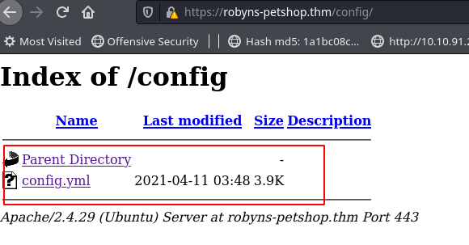

Room: [Year of the Jellyfish](https://tryhackme.com/room/yearofthejellyfish)


## Credentials

robyn@robyns-petshop.thm
staff@robyns-petshop.thm

## Subdomains
monitorr.robyns-petshop.thm
dev.robyns-petshop.thm

## Nmap Scan

```sql
PORT     STATE SERVICE  REASON         VERSION
21/tcp   open  ftp      syn-ack ttl 23 vsftpd 3.0.3
22/tcp   open  ssh      syn-ack ttl 23 OpenSSH 5.9p1 Debian 5ubuntu1.4 (Ubuntu Linux; protocol 2.0)
| ssh-hostkey:
|   2048 46:b2:81:be:e0:bc:a7:86:39:39:82:5b:bf:e5:65:58 (RSA)
|_ssh-rsa AAAAB3NzaC1yc2EAAAADAQABAAABAQC3op12UwFIehC/VLx5tzBbmCUO/IzJlyueCj1/qP7tq3DcrBu9iQbC1gYemElU2FhqHH2KQr9MFrWRJgU4dH0iQOFld1WU9BNjfr6VcLOI+flLQstwWf1mJXEOdDjA98Cx+blYWG62qwXLiW+aq2jLfIZkVjJlp7OueNeocxE0P7ynTqJIadMfeNqNZ1Jc+s7aCBSg0NRSh0FsABAG+BSFhybnKXtApc+RG0QQ3vFpnU0k0PVZvg/qU/Eb6Oimm67d8hjclPbPpQoyvsdyOQG7yVS9eIglTr00ddw2Jn8wrapOa4TcBJGu9cgSgITHR8+htJ1LLj3EtsmJ0pErEv0B
80/tcp   open  http     syn-ack ttl 23 Apache httpd 2.4.29
| http-methods:
|_  Supported Methods: GET HEAD POST OPTIONS
|_http-server-header: Apache/2.4.29 (Ubuntu)
|_http-title: Did not follow redirect to https://robyns-petshop.thm/
443/tcp  open  ssl/http syn-ack ttl 26 Apache httpd 2.4.29 ((Ubuntu))
| http-methods:
|_  Supported Methods: GET HEAD POST OPTIONS
|_http-server-header: Apache/2.4.29 (Ubuntu)
|_http-title: Robyn&#039;s Pet Shop
| ssl-cert: Subject: commonName=robyns-petshop.thm/organizationName=Robyns Petshop/stateOrProvinceName=South West/countryName=GB/localityName=Bristol/emailAddress=robyn@robyns-petshop.thm
| Subject Alternative Name: DNS:robyns-petshop.thm, DNS:monitorr.robyns-petshop.thm, DNS:beta.robyns-petshop.thm, DNS:dev.robyns-petshop.thm
| Issuer: commonName=robyns-petshop.thm/organizationName=Robyns Petshop/stateOrProvinceName=South West/countryName=GB/localityName=Bristol/emailAddress=robyn@robyns-petshop.thm
| Public Key type: rsa
| Public Key bits: 2048
| Signature Algorithm: sha256WithRSAEncryption
| Not valid before: 2021-04-25T19:54:33
| Not valid after:  2022-04-25T19:54:33
| MD5:   16c0 051e f8e5 448f 4072 79c0 6edb e79b
| SHA-1: 3c87 eac5 cb16 ba43 bb9b f6e7 cbc6 dc99 8c40 d86c
| -----BEGIN CERTIFICATE-----
| MIIEPzCCAyegAwIBAgIUaKkX4zADrKLHsRyK6B74m78U5FkwDQYJKoZIhvcNAQEL
| BQAwgZMxCzAJBgNVBAYTAkdCMRMwEQYDVQQIDApTb3V0aCBXZXN0MRAwDgYDVQQH
| DAdCcmlzdG9sMRcwFQYDVQQKDA5Sb2J5bnMgUGV0c2hvcDEbMBkGA1UEAwwScm9i
| eW5zLXBldHNob3AudGhtMScwJQYJKoZIhvcNAQkBFhhyb2J5bkByb2J5bnMtcGV0
| c2hvcC50aG0wHhcNMjEwNDI1MTk1NDMzWhcNMjIwNDI1MTk1NDMzWjCBkzELMAkG
| A1UEBhMCR0IxEzARBgNVBAgMClNvdXRoIFdlc3QxEDAOBgNVBAcMB0JyaXN0b2wx
| FzAVBgNVBAoMDlJvYnlucyBQZXRzaG9wMRswGQYDVQQDDBJyb2J5bnMtcGV0c2hv
| cC50aG0xJzAlBgkqhkiG9w0BCQEWGHJvYnluQHJvYnlucy1wZXRzaG9wLnRobTCC
| ASIwDQYJKoZIhvcNAQEBBQADggEPADCCAQoCggEBAMDyJJL5szkzt7658i3PmocD
| O6bxAOYpum6Qwt5SU8dMocdpRdXHcNSm9NNdwHX2trmj899jmR2UBw8e7iF31wWj
| yY9ILUTCz/3js5lHFENM49Pp09R2a7xIhfwKp2F5bI0EutddpaW15ypU48lrc28x
| Yyh6UrDN2F9eSGvi7UsVBfZ4JhouRXWe89QPSsXIxFzTuAKHaO7AyOn0C1etuz1U
| I35mwB6zL7jjQnYC8YoQ3XiZNQfMH7qlMINnCdsS4Ty9AqxQzicXsJIHmIgz/a4D
| +E2cozN0GNersjsKI+/xzPDCq8u8qMCVGKDEllT85YQyU/v8755f1DED/3kr/O0C
| AwEAAaOBiDCBhTAJBgNVHRMEAjAAMAsGA1UdDwQEAwIF4DBrBgNVHREEZDBighJy
| b2J5bnMtcGV0c2hvcC50aG2CG21vbml0b3JyLnJvYnlucy1wZXRzaG9wLnRobYIX
| YmV0YS5yb2J5bnMtcGV0c2hvcC50aG2CFmRldi5yb2J5bnMtcGV0c2hvcC50aG0w
| DQYJKoZIhvcNAQELBQADggEBACjQkOBuGzPbMsuwW/mFE7UiVUc/xaB6WgIw3sOq
| z1CsmCSZTcpP7wASmrDsqqiZpBF+9Vs6PfaPJkSq/04q6hu521fTvBLHkeuLRDrR
| 8A9bmEXAiAMvh3yf7IN+jcju10YgVY0m3vTeSFZRrR7fTetjGGrajB0cyhpbS+fO
| m/L3BeBfU3aZExb9BIQ8DvjQH+KNaupDlz6asdbXLUbLLnmGcaG+Zhi8Opirqa8q
| oMXvaQ2AaCvY6GQCG2Vh9CAx6wwINCZaB+RJ+8kA1d2aRZtgFyn3YrbuN1ytcZPS
| ZvhBxKs8HtYzT0+3zNywdFlEc9aGiYymbr8K6IxAxVCPnvg=
|_-----END CERTIFICATE-----
|_ssl-date: TLS randomness does not represent time
| tls-alpn:
|_  http/1.1
8000/tcp open  http-alt syn-ack ttl 25
| fingerprint-strings:
|   GenericLines:
|     HTTP/1.1 400 Bad Request
|     Content-Length: 15
|_    Request
| http-methods:
|_  Supported Methods: POST OPTIONS
1 service unrecognized despite returning data. If you know the service/version, please submit the following fingerprint at https://nmap.org/cgi-bin/submit.cgi?new-service :
SF-Port8000-TCP:V=7.91%I=7%D=4/25%Time=6085D11F%P=x86_64-pc-linux-gnu%r(Ge
SF:nericLines,3F,"HTTP/1\.1\x20400\x20Bad\x20Request\r\nContent-Length:\x2
SF:015\r\n\r\n400\x20Bad\x20Request");
Service Info: OSs: Unix, Linux; CPE: cpe:/o:linux:linux_kernel

```

## FFUF

```sql

ffuf -w /usr/share/wordlists/dirb/common.txt -u https://robyns-petshop.thm/FUZZ -c

        /'___\  /'___\           /'___\
       /\ \__/ /\ \__/  __  __  /\ \__/
       \ \ ,__\\ \ ,__\/\ \/\ \ \ \ ,__\
        \ \ \_/ \ \ \_/\ \ \_\ \ \ \ \_/
         \ \_\   \ \_\  \ \____/  \ \_\
          \/_/    \/_/   \/___/    \/_/

       v1.3.0 Kali Exclusive <3
________________________________________________

 :: Method           : GET
 :: URL              : https://robyns-petshop.thm/FUZZ
 :: Wordlist         : FUZZ: /usr/share/wordlists/dirb/common.txt
 :: Follow redirects : false
 :: Calibration      : false
 :: Timeout          : 10
 :: Threads          : 40
 :: Matcher          : Response status: 200,204,301,302,307,401,403,405
________________________________________________

.hta                    [Status: 403, Size: 284, Words: 20, Lines: 10]
                        [Status: 200, Size: 3671, Words: 739, Lines: 75]
.htaccess               [Status: 403, Size: 284, Words: 20, Lines: 10]
.htpasswd               [Status: 403, Size: 284, Words: 20, Lines: 10]
assets                  [Status: 301, Size: 327, Words: 20, Lines: 10]
business                [Status: 401, Size: 466, Words: 42, Lines: 15]
config                  [Status: 301, Size: 327, Words: 20, Lines: 10]
content                 [Status: 301, Size: 328, Words: 20, Lines: 10]
index.php               [Status: 200, Size: 3671, Words: 739, Lines: 75]
LICENSE                 [Status: 200, Size: 1085, Words: 156, Lines: 22]
plugins                 [Status: 301, Size: 328, Words: 20, Lines: 10]
server-status           [Status: 403, Size: 284, Words: 20, Lines: 10]
themes                  [Status: 301, Size: 327, Words: 20, Lines: 10]
vendor                  [Status: 301, Size: 327, Words: 20, Lines: 10]

```
### Config


